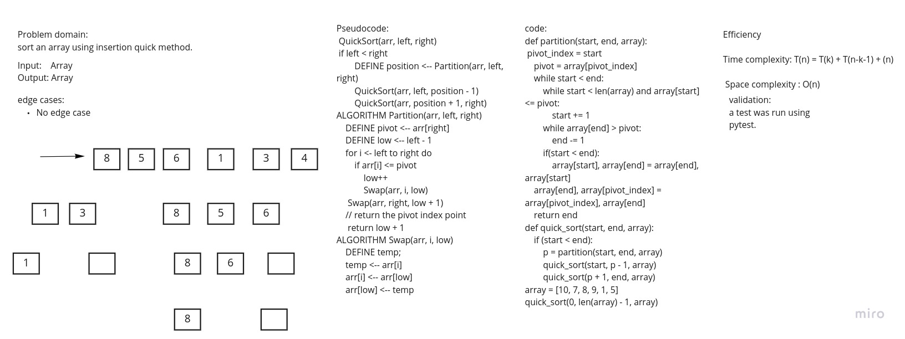

# Challenge Summary

Write a blog explained how merge quick works.

[Blog link](blog.md)

## Whiteboard Process

## Approach & Efficiency

Efficiency

Time complexity: T(n) = T(k) + T(n-k-1) + (n)

 Space complexity : O(n)

## Solution
<!-- Show how to run your code, and examples of it in action -->

def partition(start, end, array):

    pivot_index = start
    pivot = array[pivot_index]

    while start < end:

        while start < len(array) and array[start] <= pivot:
            start += 1

        while array[end] > pivot:
            end -= 1

        if(start < end):
            array[start], array[end] = array[end], array[start]

    array[end], array[pivot_index] = array[pivot_index], array[end]
    return end

def quick_sort(start, end, array):

    if (start < end):
        p = partition(start, end, array)
        quick_sort(start, p - 1, array)
        quick_sort(p + 1, end, array)
