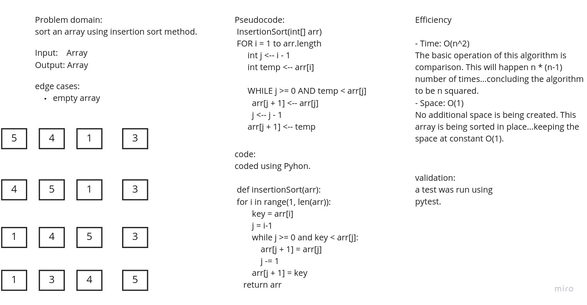

# Challenge Summary

Write a blog explained how insertion sort works.

[Blog link](blog.md)

## Whiteboard Process

## Approach & Efficiency

Efficiency

- Time: O(n^2)
The basic operation of this algorithm is comparison. This will happen n * (n-1) number of times…concluding the algorithm to be n squared.
- Space: O(1)
No additional space is being created. This array is being sorted in place…keeping the space at constant O(1).

## Solution
<!-- Show how to run your code, and examples of it in action -->
def insertionSort(arr):

    for i in range(1, len(arr)):

        key = arr[i]
        j = i-1
        while j >= 0 and key < arr[j]:
            arr[j + 1] = arr[j]
            j -= 1
        arr[j + 1] = key
    return arr

