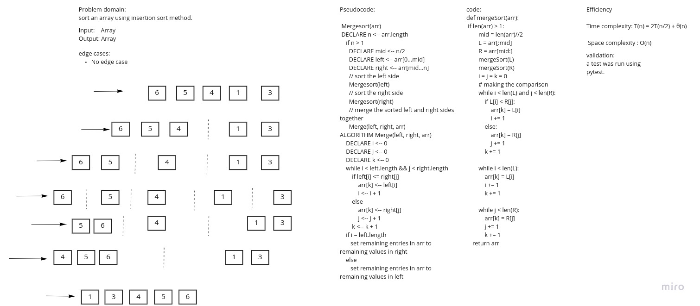

# Challenge Summary

Write a blog explained how merge sort works.

[Blog link](blog.md)

## Whiteboard Process

## Approach & Efficiency

Efficiency

Time complexity: T(n) = 2T(n/2) + θ(n)

 Space complexity : O(n)

## Solution
<!-- Show how to run your code, and examples of it in action -->

def mergeSort(arr):
    if len(arr) > 1:
        mid = len(arr)//2
        L = arr[:mid]
        R = arr[mid:]
        mergeSort(L)
        mergeSort(R)
        i = j = k = 0
        # making the comparison
        while i < len(L) and j < len(R):
            if L[i] < R[j]:
                arr[k] = L[i]
                i += 1
            else:
                arr[k] = R[j]
                j += 1
            k += 1

        while i < len(L):
            arr[k] = L[i]
            i += 1
            k += 1

        while j < len(R):
            arr[k] = R[j]
            j += 1
            k += 1
    return arr
