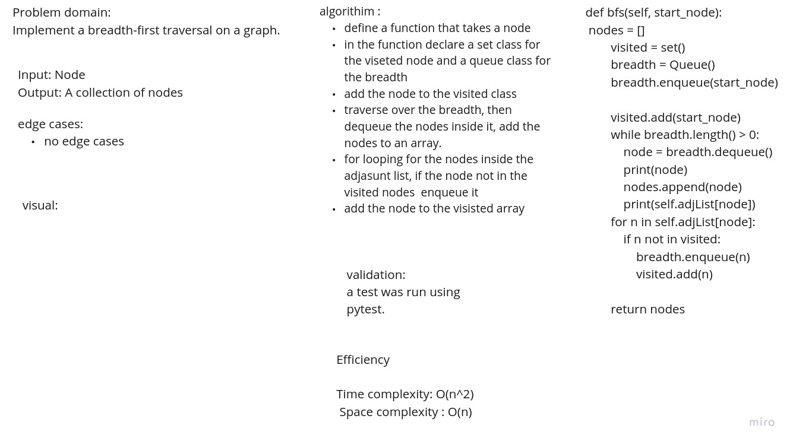

# graph

Implement your own Graph. The graph should be represented as an adjacency list:

## Challenge

to write methods for graph data structure.

## whiteboard

## Approach & Efficiency
<!-- What approach did you take? Why? What is the Big O space/time for this approach? -->

API's:

AddNode

AddEdge

GetNodes

GetNeighbors

Size

dbs
