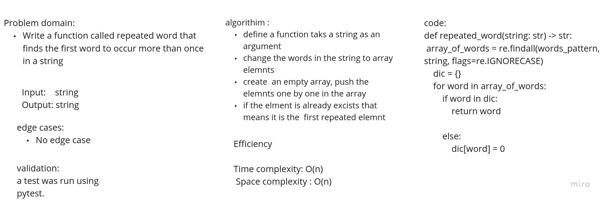

# Challenge Summary

Write a function called repeated word that finds the first word to occur more than once in a string

## Whiteboard Process

## Approach & Efficiency
bigO = O(n)
## Solution
<!-- Show how to run your code, and examples of it in action -->
def repeated_word(string: str) -> str:
    array_of_words = re.findall(words_pattern, string, flags=re.IGNORECASE)
    dic = {}
    for word in array_of_words:
        if word in dic:
            return word

        else:
            dic[word] = 0
