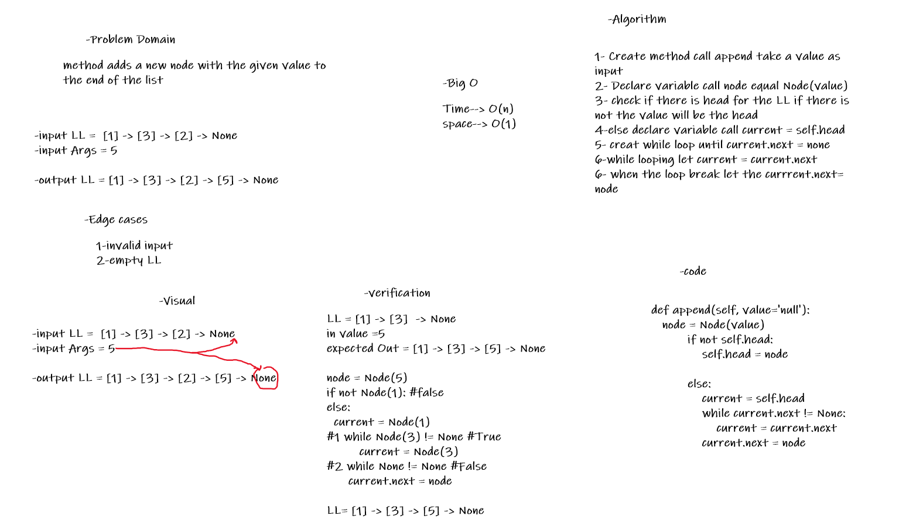
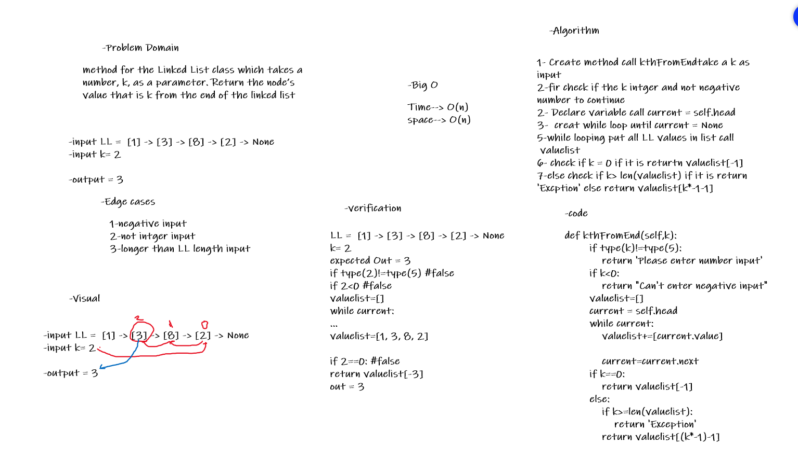
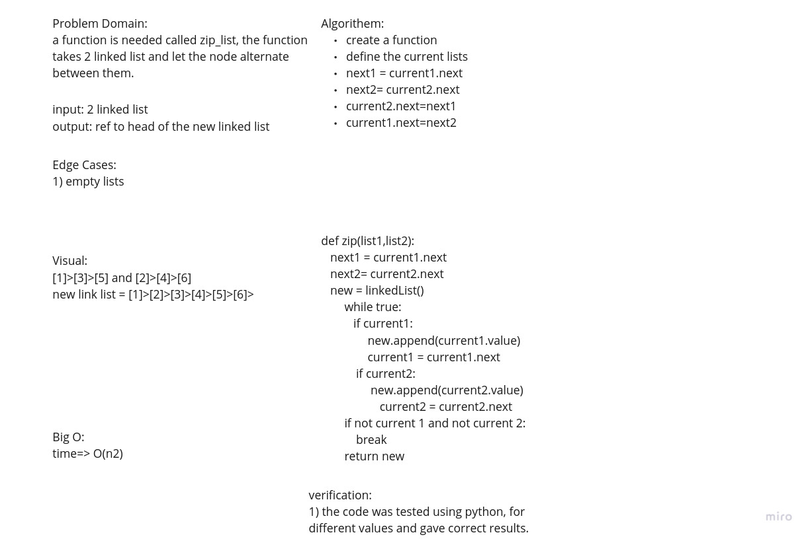

Challenge Summary

adding these features: append arguments: new value adds a new node with the given value to the end of the list insert before arguments: value, new value adds a new node with the given new value immediately before the first node that has the value specified insert after arguments: value, new value adds a new node with the given new value immediately after the first node that has the value specified
Whiteboard Process

** lab 7 

** lab 8

Approach & Efficiency

Node class that has properties for the value stored in the Node, and a pointer to the next Node, LinkedList class, include a head property. Upon instantiation, an empty Linked. Efficiency :

insert : time : O(1) space : O(1)
append : time : O(n) space : O(1)
includes : time : O(n) space : O(1)
__ str __ time : O(n) space : O(n)
insertBefore : time : O(n) space : O(1)
insertAfter : time : O(n) space : O(1)
kthFromEnd : time : O(n) space : O(n)

Solution

https://github.com/abdu-zeyad/data-structures-and-algorithms/pull/20