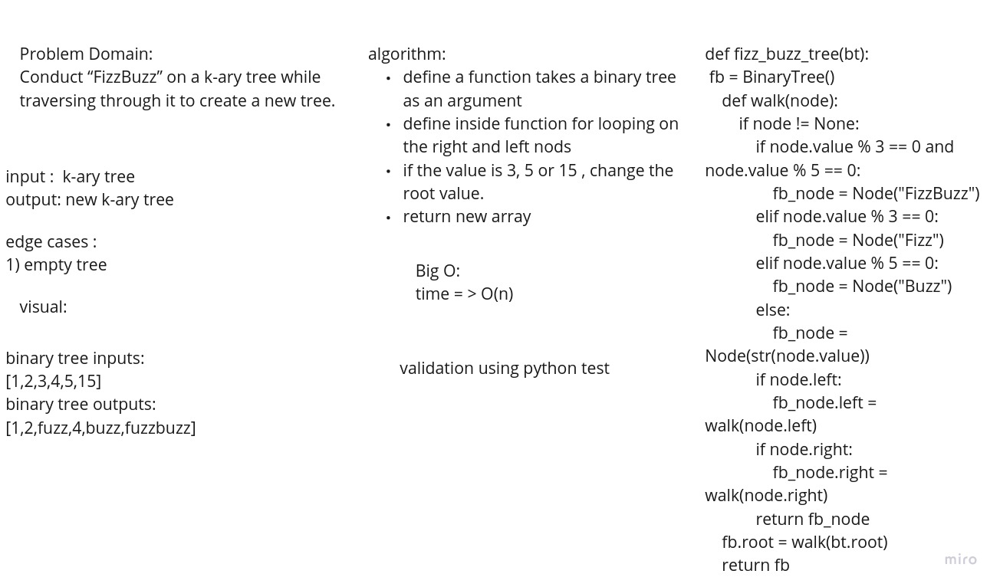

# Trees
A tree data structure is a non-linear data structure because it does not store in a sequential manner
## Challenge
- Create a Node class that has properties for the value stored in the node, the left child node, and the right child node.
- Create a Binary Tree class with three methods:
    1) pre order
    2) in order
    3) post order 
- Create a Binary Search Tree class with 2 methods 
    1) Add
    2) Contains
## Approach & Efficiency
- traversal method used to solve it. 
## API
pre order: root>left>right
in order : left > root > right
post order : left > right > root 
add : adding a new node
contains: check if a value inside the tree

code challenge :

# Challenge Summary
Find the Maximum Value in a Binary Tree

## Whiteboard Process

## Approach & Efficiency
using a recursive function to iterate over the right and left nodes to find the maximum.
## Solution
def max(self):
        if not self.root:
            return "Tree is Empty"
        self.max = self.root.value

        def tree(node):
            if node.value > self.max:
                self.max = node.value
            if node.left:
                tree(node.left)
            if node.right:
                tree(node.right)
            return self.max

        return tree(self.root)

challenge 17 :
# Challenge Summary
Write a function called breadth first
Arguments: tree
Return: list of all values in the tree, in the order they were encountered

## Whiteboard Process

## Approach & Efficiency
using a recursive function to iterate over the right and left nodes to find print all the elements.
## Solution
 def breadth_first(self):
        values = []
        tree = self.root
        values.append(tree.value)
        # print(values)

        def walk(left, right):
            if left is not None:
                values.append(left.value)
                walk(left.left, left.right)

            if right is not None:
                values.append(right.value)
                walk(right.left, right.right)

        walk(tree.left, tree.right)
        return values

challenge 18 :
# Challenge Summary
Write a function called fizz buzz tree

If the value is divisible by 3, replace the value with “Fizz”
If the value is divisible by 5, replace the value with “Buzz”
If the value is divisible by 3 and 5, replace the value with “FizzBuzz”
If the value is not divisible by 3 or 5, simply turn the number into a String.

## Whiteboard Process

## Approach & Efficiency
using a recursive function to iterate over the right and left nodes to  print all the elements which are divisible on 3 ,5 and 15.
## Solution
def fizz_buzz_tree(bt):
    if type(bt) != BinaryTree:
        return "Invalid Input"
    if not bt.root:
        return "Tree is empty"

    def walk(node):
        if node != None:
            if node.value % 3 == 0 and node.value % 5 == 0:
                fb_node = Node("FizzBuzz")
            elif node.value % 3 == 0:
                fb_node = Node("Fizz")
            elif node.value % 5 == 0:
                fb_node = Node("Buzz")
            else:
                fb_node = Node(str(node.value))

            if node.left:
                fb_node.left = walk(node.left)
            if node.right:
                fb_node.right = walk(node.right)

            return fb_node

    fb = BinaryTree()
    fb.root = walk(bt.root)

    return fb