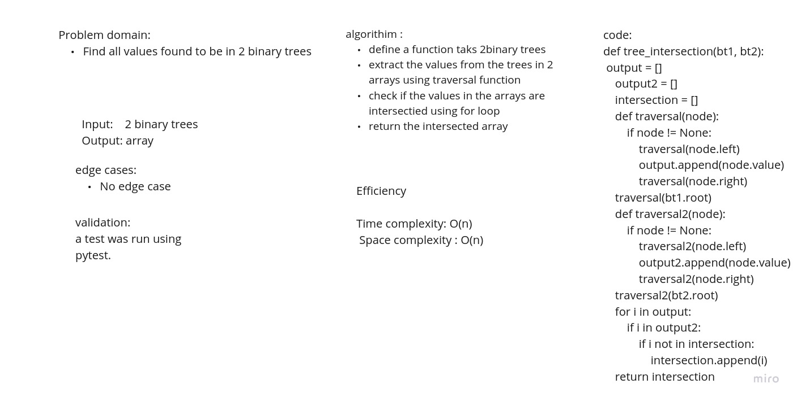

# Challenge Summary

Find all values found to be in 2 binary trees

Write a function called tree intersection
Arguments: two binary trees
Return: array

## Whiteboard Process

## Approach & Efficiency

bigO = O(n)

## Solution

<!-- Show how to run your code, and examples of it in action -->
def tree_intersection(bt1, bt2):
    output = []
    output2 = []
    intersection = []

    def traversal(node):
        if node != None:
            traversal(node.left)
            output.append(node.value)
            traversal(node.right)
    traversal(bt1.root)

    def traversal2(node):
        if node != None:
            traversal2(node.left)
            output2.append(node.value)
            traversal2(node.right)
    traversal2(bt2.root)

    for i in output:
        if i in output2:
            if i not in intersection:
                intersection.append(i)

    return intersection
