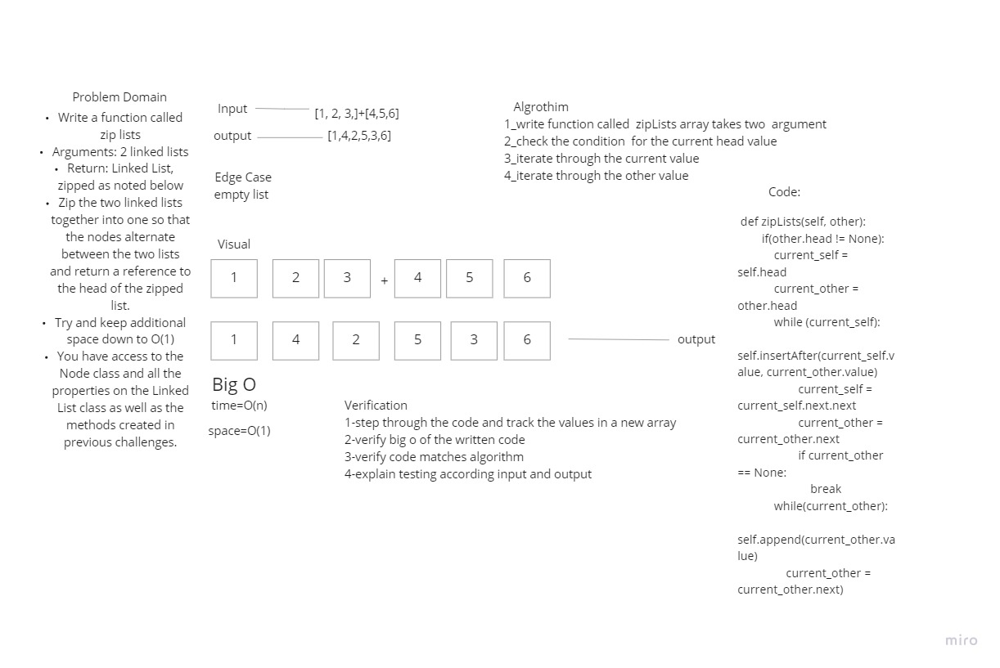

Singly Linked List
linked list is a group of nodes hat points to each others

Challenge '4' :
#Challenge Summary
Write a function called zip lists
Arguments: 2 linked lists
Return: Linked List, zipped as noted below
Zip the two linked lists together into one so that the nodes alternate between the two lists and return a reference to the head of the zipped list.
Try and keep additional space down to O(1)

Approach & Efficiency
a Node class that has properties for the value stored in the Node, and a pointer to the next Node. Within the LinkedList class, a head property included. Upon instantiation, an empty Linked List should be created. Define a method called insert which takes any value as an argument and adds a new node with that value to the head of the list with an O(1) Time performance.

a method called includes which takes any value as an argument and returns a boolean result depending on whether that value exists as a Node’s value somewhere within the list.

a method called string which takes in no arguments and returns a string representing all the values in the Linked List, formatted as: "{ a } -> { b } -> { c } -> NULL"

Approach & Efficiency
space --> O(n) time --> O(n)

API
insert function , which takes any value as an argument and add a node of a value to the head of linked list .

includes function , which takes any value as an argument and Return T/F if value is in the linked list or not

str function , which dose not takes an arguments and returns a string representing all the values in the Linked List.

https://github.com/abdu-zeyad/data-structures-and-algorithms/pull/25