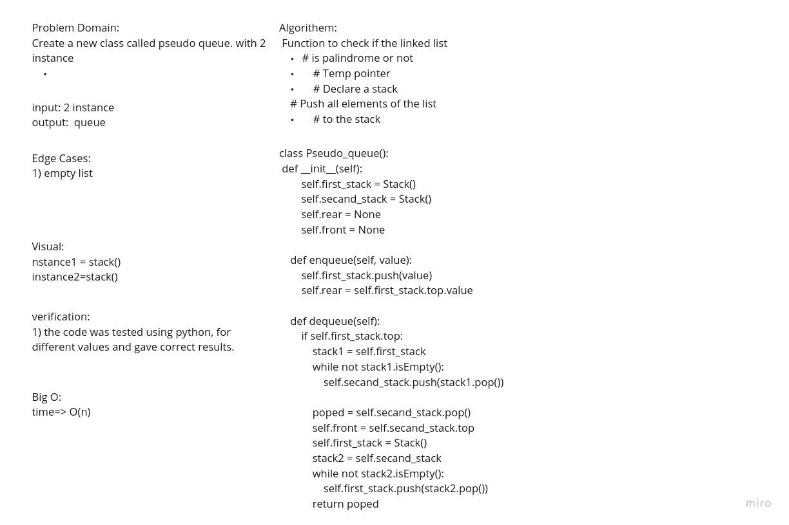
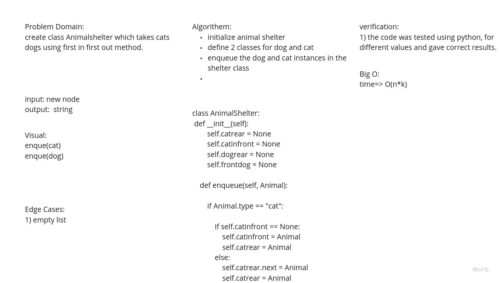

# Stacks and Queues
code challenge 11

## Challenge
Create a new class called pseudo queue.
Do not use an existing Queue.
Instead, this PseudoQueue class will implement our standard queue interface (the two methods listed below),
Internally, utilize 2 Stack instances to create and manage the queue
Methods:
enqueue
Arguments: value
Inserts value into the PseudoQueue, using a first-in, first-out approach.
dequeue
Arguments: none
Extracts a value from the PseudoQueue, using a first-in, fi## Approach & Efficiency
Stacks
push >>> O(1)
pop >>> O(1)
peek >>> O(1)
is_empty >>> O(1)
Queues
enqueue >>> O(1)
dequeue >>> O(1)
peek >>> O(1)
is_empty >>> O(1)
## API
enqueue method : for adding stack to the queue
dequeue method: for removing stack from the queue

<!-- Description of each method publicly available to your Stack and Queue-->

https://github.com/abdu-zeyad/data-structures-and-algorithms/pull/29

code challenge  12 

