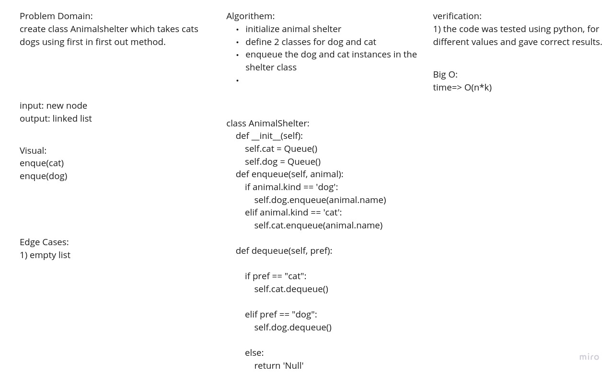

Challenge Summary

create  a class which takes dogs and cats, it is operated using first in first out method.

Approach & Efficiency:
defining 3 classes for cats, dogs and shelter. the shelter takes the dogs and cats and keep them inside.