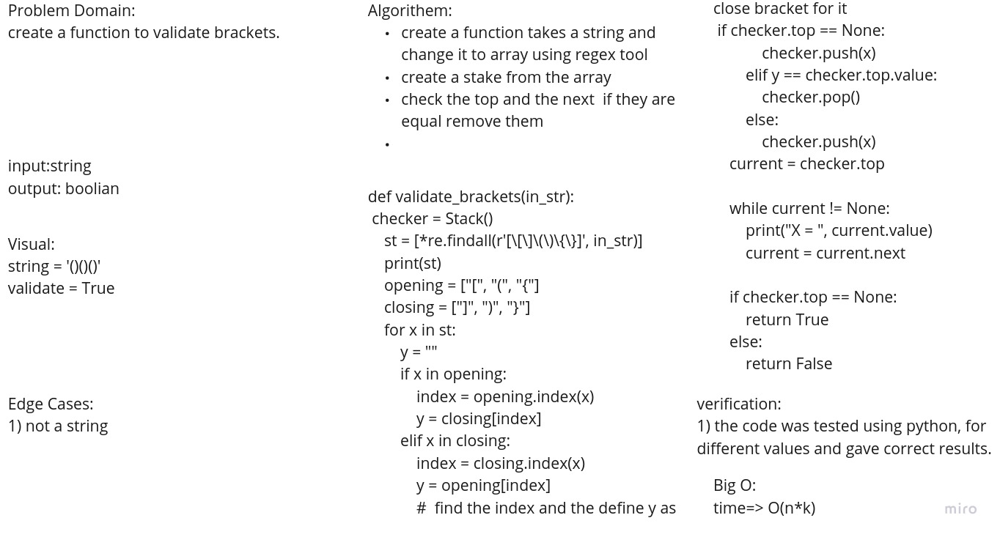

Challenge Summary

create  create a function to validate brackets.

Approach & Efficiency:
- change the string to a list
- loop over the list and push its elements to the stack.
- if the top is repeated remove both of the top and the next value.