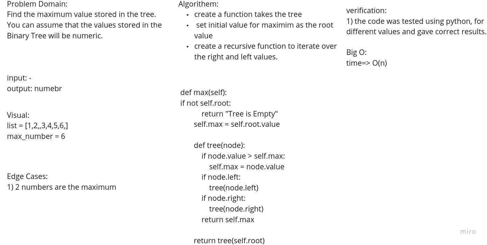
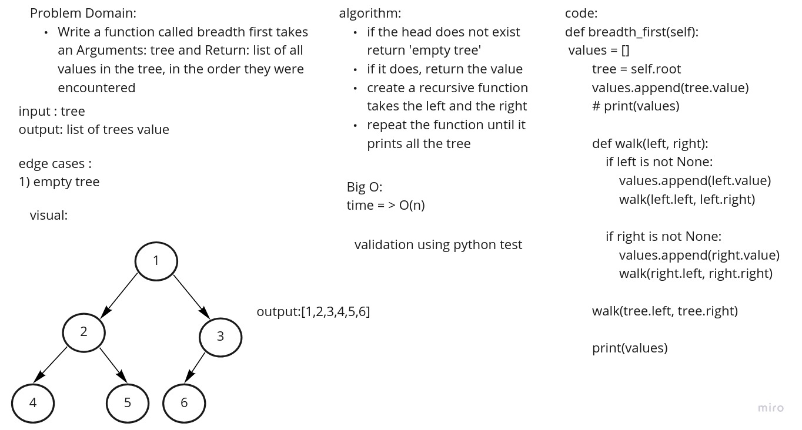

# Trees
A tree data structure is a non-linear data structure because it does not store in a sequential manner
## Challenge
- Create a Node class that has properties for the value stored in the node, the left child node, and the right child node.
- Create a Binary Tree class with three methods:
    1) pre order
    2) in order
    3) post order 
- Create a Binary Search Tree class with 2 methods 
    1) Add
    2) Contains
## Approach & Efficiency
- traversal method used to solve it. 
## API
pre order: root>left>right
in order : left > root > right
post order : left > right > root 
add : adding a new node
contains: check if a value inside the tree

code challenge :

# Challenge Summary
Find the Maximum Value in a Binary Tree

## Whiteboard Process

## Approach & Efficiency
using a recursive function to iterate over the right and left nodes to find the maximum.
## Solution
def max(self):
        if not self.root:
            return "Tree is Empty"
        self.max = self.root.value

        def tree(node):
            if node.value > self.max:
                self.max = node.value
            if node.left:
                tree(node.left)
            if node.right:
                tree(node.right)
            return self.max

        return tree(self.root)

challenge 17 :
# Challenge Summary
Write a function called breadth first
Arguments: tree
Return: list of all values in the tree, in the order they were encountered

## Whiteboard Process

## Approach & Efficiency
using a recursive function to iterate over the right and left nodes to find print all the elements.
## Solution
 def breadth_first(self):
        values = []
        tree = self.root
        values.append(tree.value)
        # print(values)

        def walk(left, right):
            if left is not None:
                values.append(left.value)
                walk(left.left, left.right)

            if right is not None:
                values.append(right.value)
                walk(right.left, right.right)

        walk(tree.left, tree.right)
        return values